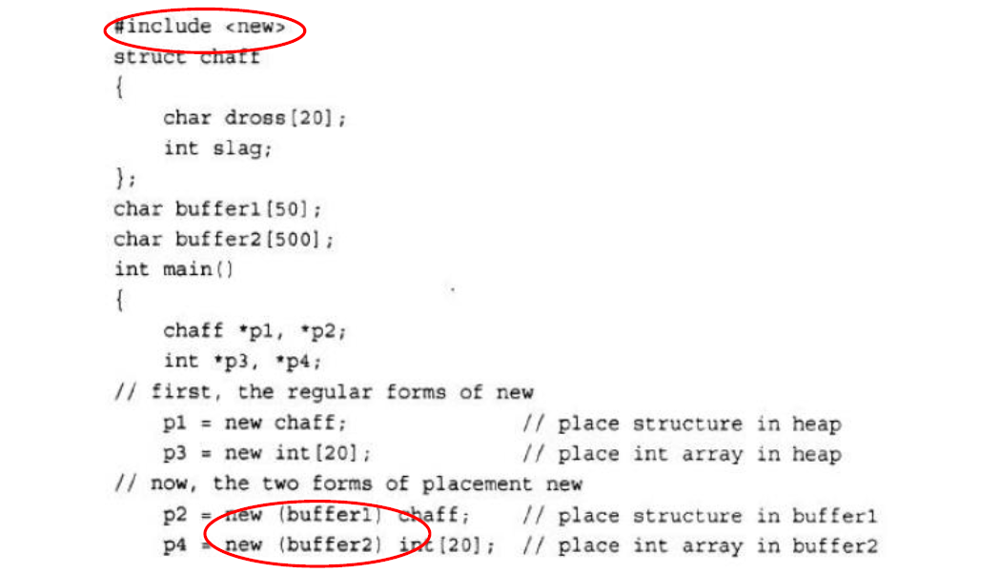

# 第八章

## 函数重载

在同一个作用域内，可以声明几个功能类似的同名函数，但是这些同名函数的形式参数（指参数的个数、类型或者顺序）必须不同。

## 函数模板

```cpp
template <class/typename type> ret-type func-name(parameter list)
{
   // 函数的主体
}

//例子：
template <typename T>
inline T const& Max (T const& a, T const& b) 
{ 
    return a < b ? b:a; 
}
int main(){
  int i = 39;
  int j = 20;
  cout << "Max(i, j): " << Max(i, j) << endl; 
} 
//Max(i, j): 39
```

函数模板可以重载

### 具体化

```cpp
//比如存在这么一个模板函数

template <typename T>
void Swap(T &a, T &b)

//第一种方式是声明所需的种类，用<>符号来指示类型，并在声明前加上关键词template，如下：
template <>
void Swap<int>(int &, int &);

//第二种方式是直接在程序中使用函数创建，如下：

Swap<int>(a,b);
```

# 第九章

第九章知识点有头文件、new和名称空间。

## 头文件

原型声明：`char *strcpy(char* dest, const char *src);`

头文件：`#include <string.h>` 和 `#include <stdio.h>`

功能：把从src地址开始且含有NULL结束符的字符串复制到以dest开始的地址空间

说明：src和dest所指内存区域不可以重叠且dest必须有足够的空间来容纳src的字符串。
返回指向dest的指针。

## 动态分配

定位new运算符能指定要使用的位置



new完后返回指向该部分内存的指针

## 名称空间

## 补充

### getline()

两种getline函数，一种在头文件`<iostream>`中，是iostream类的成员函数，另一种在头文件`<string>`中，是普通函数。

第一种： 在`<istream>`中的`getline()`函数有两种重载形式：

```cpp
istream& getline (char* s, streamsize n );
istream& getline (char* s, streamsize n, char delim );
```

作用是： 从iostream中读取至多n个字符(包含结束标记符)保存在s对应的数组中。即使还没读够n个字符，如果遇到delim或 字数达到限制，则读取终止，delim都不会被保存进s对应的数组中。