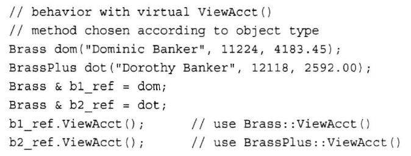

# 第四章

## 字符串

cin使用空格、制表符或换行符来确定字符串的结尾位置，可以使用getline()来解决此类问题。

`cin.getline()`有两个参数，第一个用来存储输入的数组名称，第二个要读取的字符数。

`cin.get()`参数与getline相同，不过它会把换行符也读进去。get()可以没有参数

## string类

```cpp
#include<string>
using namespace std;

//赋值
string str = "mmmmm";

//合并
string str3 = str2 + str1;
```

## 结构体


## 枚举（enum）


## 指针和自由存储空间


new和delete要配对


new完返回的是指针类型

使用new创建动态结构体对象。访问结构体成员应该用“->”而不是“.”。只要是通过指针访问的结构体对象成员（类对象成员也一样），用一根针“->”.

```cpp
(*ps).member_a = 1;
//或者
ps->member_a = 1;
```

总结： 
箭头（->）：左边必须为指针； 
点号（.）：左边必须为实体。

# 第五章

## strcmp()

```cpp
#include <cstring>

using namespace std;
```

功能：比较字符串s1和s2。

一般形式：`strcmp(字符串1，字符串2)`

字符串1和字符串2是放在字符数组里的（char[]）

返回值：

当s1<s2时，返回值<0

当s1=s2时，返回值=0

当s1>s2时，返回值>0

# 第八章

## 函数重载

在同一个作用域内，可以声明几个功能类似的同名函数，但是这些同名函数的形式参数（指参数的个数、类型或者顺序）必须不同。

## 函数模板

```cpp
template <class/typename type> ret-type func-name(parameter list)
{
   // 函数的主体
}

//例子：
template <typename T>
inline T const& Max (T const& a, T const& b) 
{ 
    return a < b ? b:a; 
}
int main(){
  int i = 39;
  int j = 20;
  cout << "Max(i, j): " << Max(i, j) << endl; 
} 
//Max(i, j): 39
```

函数模板可以重载

### 具体化

```cpp
//比如存在这么一个模板函数

template <typename T>
void Swap(T &a, T &b)

//第一种方式是声明所需的种类，用<>符号来指示类型，并在声明前加上关键词template，如下：
template <>
void Swap<int>(int &, int &);

//第二种方式是直接在程序中使用函数创建，如下：

Swap<int>(a,b);
```

# 第九章

第九章知识点有头文件、new和名称空间。

## 头文件

原型声明：`char *strcpy(char* dest, const char *src);`

头文件：`#include <string.h>` 和 `#include <stdio.h>`

功能：把从src地址开始且含有NULL结束符的字符串复制到以dest开始的地址空间

说明：src和dest所指内存区域不可以重叠且dest必须有足够的空间来容纳src的字符串。
返回指向dest的指针。

## 动态分配

定位new运算符能指定要使用的位置


new完后返回指向该部分内存的指针

## 名称空间

## 补充

### getline()

两种getline函数，一种在头文件`<iostream>`中，是iostream类的成员函数，另一种在头文件`<string>`中，是普通函数。

第一种： 在`<istream>`中的`getline()`函数有两种重载形式：

```cpp
istream& getline (char* s, streamsize n );
istream& getline (char* s, streamsize n, char delim );
```

作用是： 从iostream中读取至多n个字符(包含结束标记符)保存在s对应的数组中。即使还没读够n个字符，如果遇到delim或 字数达到限制，则读取终止，delim都不会被保存进s对应的数组中。

# 第十章

## this指针

this指针设置为调用它的对象的地址。所以`*this`指的就是该对象。

## 补充

### 头文件 string.h cstring string 区别

```cpp
#include <cstring>   //不可以定义string s；可以用到strcpy等函数
using   namespace   std;

#include <string>   //可以定义string s；可以用到strcpy等函数
using  namesapce   std;

#include <string.h>   //不可以定义string s；可以用到strcpy等函数
```

### 条件编译

按照不同的编译条件去编译不同的程序代码，从而使一个源程序在不同的编译条件下生成不同的目标程序。

```cpp
#ifdef DV22_AUX_INPUT
#define AUX_MODE 3 
#else
#define AUY_MODE 3
#endif
#ifndef XXX … (#else) … #endif
```

[C++ 条件编译](https://blog.csdn.net/ForestRound/article/details/52717968)

`#ifdef`和`#ifndef`的区别

```
#ifdef identifier  
#ifndef identifier  
  
// equivalent to  
#if defined identifier  
#if !defined identifier  
```

### 内联函数

用关键字 inline 放在函数定义(注意是定义而非声明，下文继续讲到)的前面即可将函数指定为内联函数

```cpp
inline int max(int a, int b)
{
    return a > b ? a : b;
}
```

则调用：`cout << max(a, b) << endl;`

在编译时展开为：`cout << (a > b ? a : b) << endl;`

这样做的好处是把一个函数变成几条语句去执行，几条语句的执行要比函数的执行快。

### 在类声明函数中使用const

例：

```cpp
class MyClass
{
private:
    int counter;
public:
    void Foo()
    { 
        std::cout << "Foo" << std::endl;    
    }

    void Foo() const
    {
        std::cout << "Foo const" << std::endl;
    }

};
```

你可以在类里面定义两个同名的函数，一个有加const，一个没有。有加const的函数不能更改类成员。例如：

```cpp
//错误
void Foo() const
    {
        counter++; //this will not compile
        std::cout << "Foo const" << std::endl;
    }
```

### 在类声明函数中使用static

static成员函数主要目的是作为类作用域的全局函数。

静态成员不能在类的定义里初始化（除int外）。不能在头文件里初始化。
比如定义了 myclass.h，一般放到myclass.cpp里初始化它。

数据类型 类名::静态数据成员名=值；

```cpp
class foo{
public:
  foo();
private:
static int i;
};
 
intfoo::i=20;
```

### static const

```cpp
static const int NUM = 1000;
```

写在函数外就是在当前源文件可见,不能被其他文件使用。

```cpp
void foo()
{
    static const int A = 0;    // 多次调用foo，&A不变。
    const int B = 0;           // 多次调用foo，&B不固定。
}
```

写在函数里则是说明是静态变量，多次调用这个函数，都共用同一个内存，而不是栈里产生新的。

### const修饰函数参数

如果参数作输出用，不论它是什么数据类型，也不论它采用“指针传递”还是“引用传递”，都不能加const 修饰，否则该参数将失去输出功能。const 只能修饰输入参数：如果输入参数采用“指针传递”，那么加const 修饰可以防止意外地改动该指针，起到保护作用。

### 指针运算符（`&` 和 `*`）

指针是一个包含了另一个变量地址的变量。C++ 提供了两种指针运算符，一种是取地址运算符 `&`，一种是间接寻址运算符 `*`。

`&`返回操作数的内存地址。例如，如果 var 是一个整型变量，则 `&var` 是它的地址。

`*` 返回操作数所指定地址的变量的值。

### int &

```
int＆a = b; 
```

a的地址设置为b的地址（a是对b的引用）。对a进行修改同时也会修改b

# 第十一章

## 重载运算符

重定义或重载C++ 内置的运算符。重载的运算符是带有特殊名称的函数，函数名是由关键字 operator 和其后要重载的运算符符号构成的。与其他函数一样，重载运算符有一个返回类型和一个参数列表。

```cpp
//声明加法运算符用于把两个 Box 对象相加，返回最终的 Box 对象。

//Class Box
Box operator+(const Box& b)
      {
         Box box;
         box.length = this->length + b.length;
         box.breadth = this->breadth + b.breadth;
         box.height = this->height + b.height;
         return box;
      }

//main.cpp
// 把两个对象相加，得到 Box3
Box3 = Box1 + Box2;
//或者
Box3 = Box1.operator+(Box2);
```

## 友元

类的友元函数是定义在类外部，但有权访问类的所有私有（private）成员和保护（protected）成员。尽管友元函数的原型有在类的定义中出现过，但是友元函数并不是成员函数。

友元可以是一个函数，该函数被称为友元函数；友元也可以是一个类，该类被称为友元类，在这种情况下，整个类及其所有成员都是友元。

```cpp
#include <iostream>
 
using namespace std;
 
class Box
{
   double width;
public:
   friend void printWidth( Box box );
   void setWidth( double wid );
};

// 成员函数定义
void Box::setWidth( double wid )
{
    width = wid;
}

// 请注意：printWidth() 不是任何类的成员函数
void printWidth( Box box )
{
   /* 因为 printWidth() 是 Box 的友元，它可以直接访问该类的任何成员 */
   cout << "Width of box : " << box.width <<endl;
}
 
// 程序的主函数
int main( )
{
   Box box;
 
   // 使用成员函数设置宽度
   box.setWidth(10.0);
   
   // 使用友元函数输出宽度
   printWidth( box );
 
   return 0;
}
```

## 补充

### 文件中的#ifndef 

头件的中的#ifndef，这是一个很关键的东西。比如你有两个C文件，这两个C文件都include了同一个头文件。而编译时，这两个C文件要一同编译成一个可运行文件，于是问题来了，大量的声明冲突。 
还是把头文件的内容都放在#ifndef和#endif中吧。不管你的头文件会不会被多个文件引用，你都要加上这个。一般格式是这样的： 

```
#ifndef <标识> 
#define <标识> 
...... 
#endif 
```

# 十二章

## 在构造函数中使用new注意的事项


# 十三章

## 一个简单基类

从一个类派生出另一个类时，原始类成为基类，继承类称为派生类。

可将string对象或C-风格字符创作为构造函数的参数。前者做参数时，将调用接受`const string &`作为参数的string构造函数。后者做参数时，将调用接受`const char *`作为参数的string构造函数

派生一个类的格式：


创建派生类对象时，程序首先创建基类对象。派生类的构造函数应写成如下形式：


如果没有加上基类的成员初始化列表，那么系统将使用基类的默认构造函数。即下面这种写法：


将等同于：


### 使用派生类

基类和派生类的声明最好写在同一个文件里。

### 派生类和基类的关系

基类可以通过指针调用派生类里从基类那里继承的方法：


## 多态公有继承

派生类重新定义了基类的方法。

```cpp
class Brass
{
private:
  ...
public:
  virtual void ViewAcct() const;//虚方法
};

class BrassPlus:public Brass
{
private:
  ...
public:
  virtual void ViewAcct() const;//虚方法
}
```

如果没有使用关键字virtual,程序将根据引用类型或指针类型选择方法：


如果使用了virtual，程序将根据引用或指针指向的对象的类型来选择方法：



virtual只写在类声明中，不写在方法定义中。

派生类可以调用基类的公有方法：


## 静态联编和动态联编

将原代码中的函数调用解释成执行特定代码块被称为函数名联编。

静态联编是指联编工作在编译阶段完成的，这种联编过程是在程序运行之前完成的。

动态联编是指联编在程序运行时动态地进行，根据当时的情况来确定调用哪个同名函数，实际上是在运行时虚函数的实现。

## protected

在类外只能有公有类成员来访问protected部分的成员。private和protected只有在派生类上有区别。派生类可以直接访问基类的保护类成员。

## 抽象基类

把两个类的共性抽象出来，作为抽象基类。

比如椭圆和圆的相同点是中心坐标：


纯虚数格式：

```cpp
class <类名>

　　{

　　virtual <类型><函数名>(<参数表>)=0;

　　…

　　};
```
抽象基类至少要有一个纯虚函数。纯虚函数表示没有实现的函数，它的实现留给该基类的派生类去做

## 继承和动态内存分配

# 十四章

## valarry

```cpp
#include<valarray>
```


## 私有继承

私有继承，基类的公有成员和保护成员成为派生类的私有部分。即，基类的方法不成为派生类的方法，但派生类的成员函数可以使用他们。

格式：


使用多个基类的继承称为多重继承

## 类模板

```cpp
template <class T> //声明一个模板，虚拟类型名为T。注意：这里没有分号。
class Compare //类模板名为Compare
{
public :
   Compare(T a,T b)
   {
      x=a;y=b;
   }
   T max( )
   {
      return (x>y)?x:y;
   }
   T min( )
   {
      return (x<y)?x:y;
   }
private :
   T x,y;
};

```

在类模板外定义函数:

```cpp
template <class T>
TCompare<T>::max( )
{
     return (x > y)? x : y;
}

```

[C++ 类模板和模板类](https://blog.csdn.net/EmSoftEn/article/details/50421124)